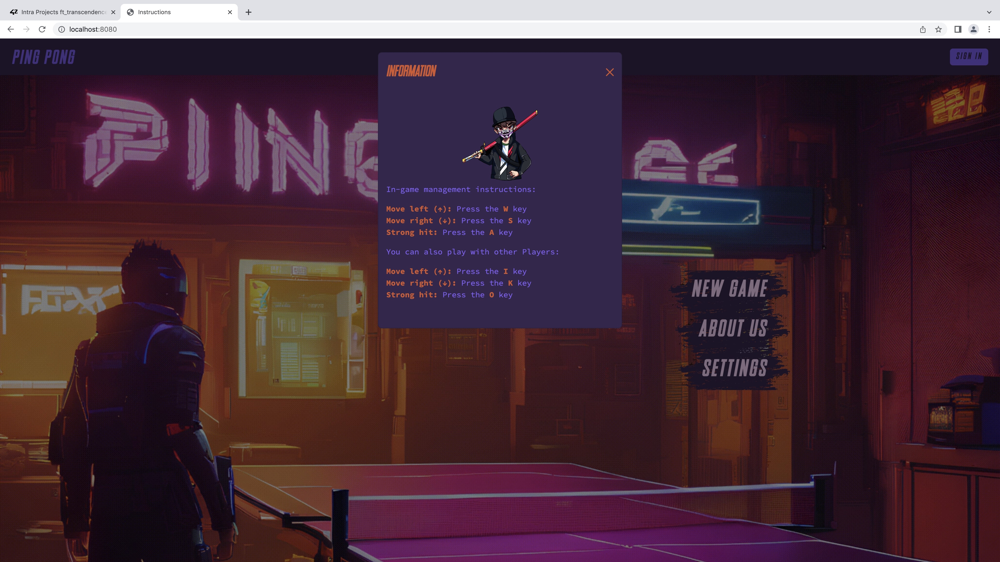
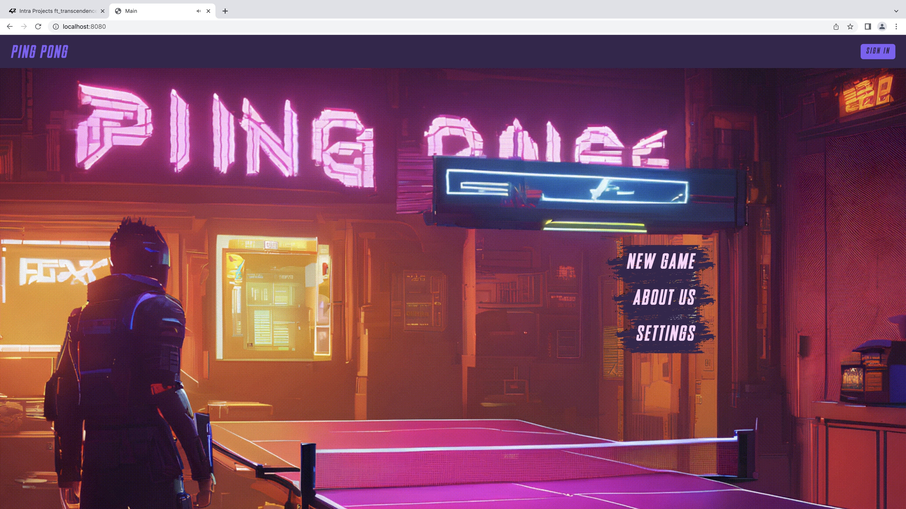
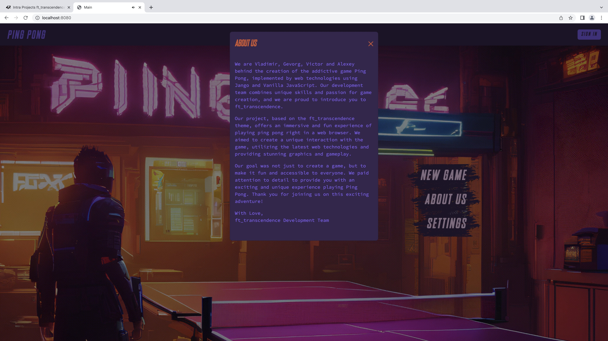
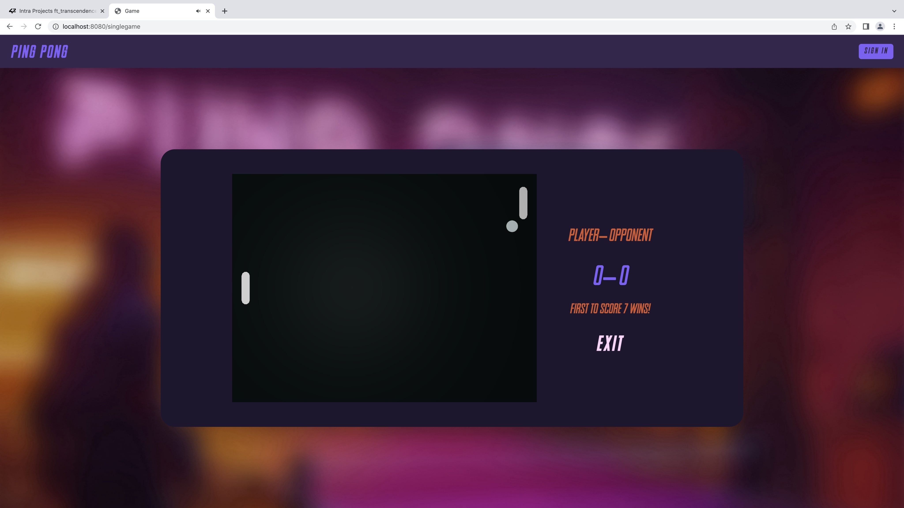

## Frontend 

Frontend development utilized the Bootstrap toolkit and vanilla javascript.

## Backend

We utilized a specific web framework for your backend development, and that framework is Django.
The designated database for all DB instances in your project is PostgreSQL.

## Blockchain

For development and testing purposes, we utilized a testing blockchain environment.
The chosen blockchain for this implementation is Ethereum , and Solidity was the programming language used for smart contract development.

## Game

The Pong game was developed using ThreeJS/WebGL to achieve the desired visual effects.

## UI

The website is responsive, adapting to different screen sizes and orientations, ensuring a consistent user experience on desktops, laptops, tablets, and smartphones.
Users can easily navigate and interact with the website using different input methods, such as touchscreens, keyboards, and mice, depending on the device they are using.
